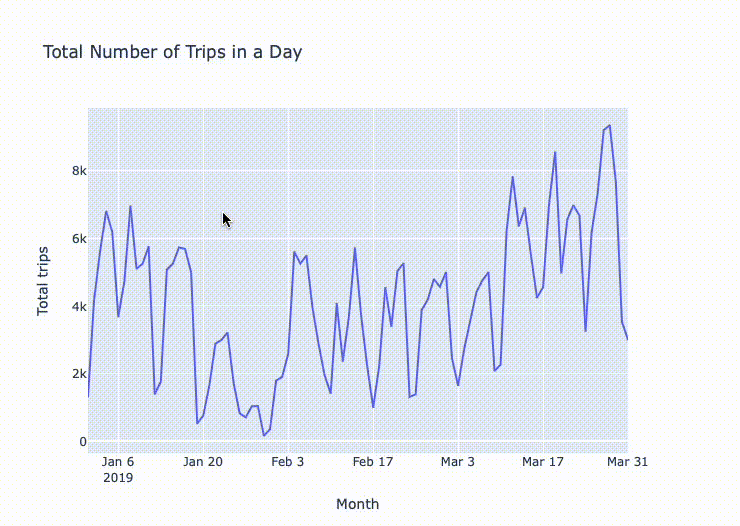

# Data-visualization-voila

## Visualization for Divvy Bike Share System
[Divvy](https://divvybikes.com) is Chicagoland’s bike share system across Chicago and Evanston. Divvy provides residents and visitors with a convenient, fun and affordable transportation option for getting around and exploring Chicago. 

We decide to explore the data Divvy provide, and make some visualization and interactive for this dataset.

### Phase 1
With exploring the dataset in phase 1, check file `phase_one.ipynb`.

### Phase 2
The second component of your project will be to design your "observatory". This could consist of drawings, prototypes of web pages or notebooks, and the code necessary to build the different components. This component is scaffolding, not the final product. It should be thought of as the "viz for peers" stage of the process. 

Check file - `FinalProject-PhaseTwo-GroupA.ipynb`

### Phase 3
We decide to deploy our interactive dashboard with **voila**. Below are installation steps and our results. Code is in file `phasethree_voila.ipynb`, below are following steps to help you install make the website run with voila and check the final results.

## Prerequisite
0. install [voila](https://voila.readthedocs.io/en/stable/install.html) in your computer.

## Steps by steps

1. Use `voila name.ipynb` to run voila.

2. It will automatically open a new website in the broswer to see the interactive page. It will take few seconds.

3. Scroll down to see what you have got in the website.

4. Total number of trips in a day.

5. Filter **birthyear** column of the dataset.

6. Filter with column **trip_duration, birthyear, bikeid** of the dataset.

7. Count of price category in 2019.

8. Percentage of price category in 2019.

9. 2019 Q1 Daily Trip Duration.

10. 2020 Q1 Daily Trip Duration.

## Result
Check the voila output with `output` file.

> Note: it is export as pdf file and cannot have any interaction.

